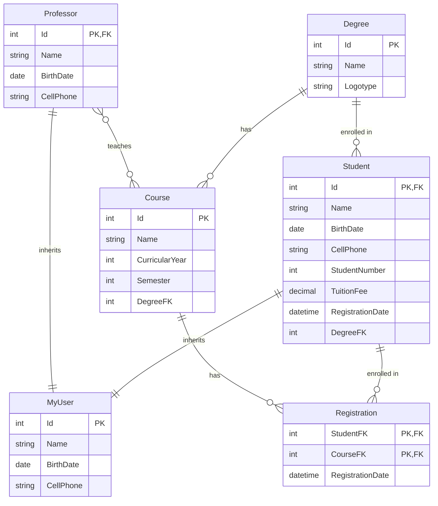

# Entity Relationship Diagram

## Models Overview

| Model | Description |
|-------|-------------|
| **MyUser** | Base class for all users (Id, Name, BirthDate, CellPhone) |
| **Student** | Inherits from MyUser. Has StudentNumber, TuitionFee, RegistrationDate |
| **Professor** | Inherits from MyUser. No additional fields |
| **Degree** | Represents a Course/degree program (Id, Name, Logotype) |
| **Course** | Represents a Subject/Discipline (Id, Name, CurricularYear, Semester) |
| **Registration** | Junction table for Student-Course relationship with additional attributes |

## Relationships Summary

### 1. Degree ↔ Course (One-to-Many)
- **Degree** has many **Courses**
- **Course** belongs to one **Degree**
- FK: `Course.DegreeFK`

### 2. Degree ↔ Student (One-to-Many)
- **Degree** has many **Students**
- **Student** belongs to one **Degree**
- FK: `Student.DegreeFK`

### 3. Professor ↔ Course (Many-to-Many - No Junction Attributes)
- **Professor** teaches many **Courses**
- **Course** is taught by many **Professors**
- Junction: Direct collection navigation (no intermediate table with extra attributes)

### 4. Student ↔ Course (Many-to-Many - With Junction Attributes)
- **Student** enrolls in many **Courses**
- **Course** has many **Students** enrolled
- Junction: **Registration** table (has `RegistrationDate` as extra attribute)
- Composite PK: `(StudentFK, CourseFK)`

---

## ER Diagram (Mermaid)

---

## Key Attributes

### MyUser (Base)
- `Id` (int, PK)
- `Name` (string, required, max 50)
- `BirthDate` (DateOnly)
- `CellPhone` (string, optional, max 19)

### Student (extends MyUser)
- `StudentNumber` (int)
- `TuitionFee` (decimal)
- `RegistrationDate` (DateTime)
- `DegreeFK` (int, FK → Degree)

### Professor (extends MyUser)
- (Inherits all from MyUser, no additional fields)

### Degree
- `Id` (int, PK)
- `Name` (string, required, max 100)
- `Logotype` (string, optional, max 50)

### Course
- `Id` (int, PK)
- `Name` (string, required, max 30)
- `CurricularYear` (int)
- `Semester` (int)
- `DegreeFK` (int, FK → Degree)

### Registration
- `StudentFK` (int, PK part 1, FK → Student)
- `CourseFK` (int, PK part 2, FK → Course)
- `RegistrationDate` (DateTime)

---

## Notes

- **Composite Primary Key** on Registration: `(StudentFK, CourseFK)` for EF Core 7+
- **Inheritance**: Student and Professor inherit from MyUser (Table-per-hierarchy likely)
- **Many-to-Many without attributes**: Professor ↔ Course uses direct collection navigation
- **Many-to-Many with attributes**: Student ↔ Course uses Registration junction table
